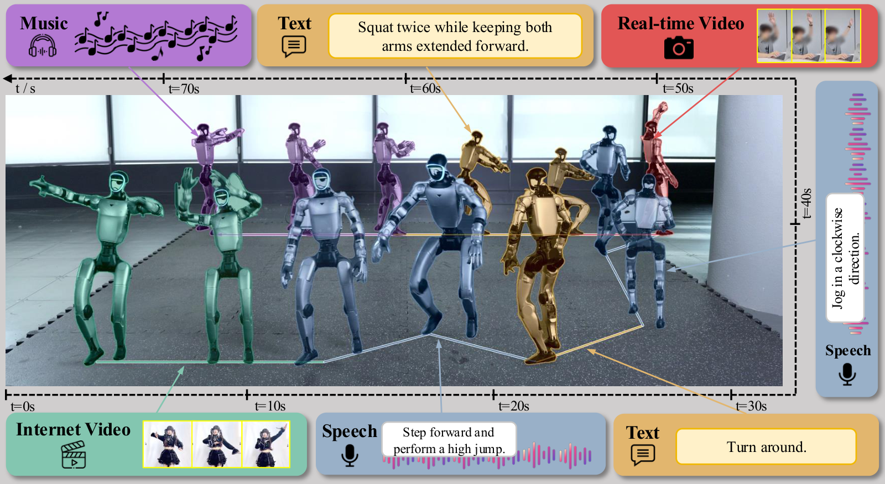

# Movens-Zero

### Scaling Humanoid Motion Foundation Models with Large-Scale Human Videos

Official repository for <strong>Movens-Zero</strong>.

  
  
  

  

Movens-Zero generates Unitree G1 whole-body motion from text, music, speech, and video.

## TODO

- [x] Self-contained inference runtime
- [x] Text, music, speech, and video inference
- [x] Motion representation and normalization
- [ ] Pretrained checkpoint release
- [ ] Training code
- [ ] Benchmark evaluation
- [ ] Sim-to-sim evaluation
- [ ] Sim-to-real deployment

## 1. Install

~~~bash
conda create -n movens-zero python=3.10 -y
conda activate movens-zero
pip install -e .
~~~

Music, speech, and video inference require FFmpeg and FFprobe.

~~~bash
conda install -c conda-forge ffmpeg
~~~

SDPA is used by default. FlashAttention 2 is optional:

~~~bash
pip install -e ".[flash]" --no-build-isolation
~~~

## 2. Download Models

Place the Movens-Zero action expert at:

~~~text
checkpoints/movens-zero.safetensors
~~~

Qwen2.5-Omni-3B is downloaded automatically from Hugging Face by default. A local copy can be passed with:

~~~bash
--backbone /path/to/Qwen2.5-Omni-3B
~~~

The repository already contains the inference configuration, motion normalization statistics, and default G1 initial pose:

~~~text
configs/inference.json
assets/normalization.json
assets/initial_pose.npy
~~~

## 3. Inference

### Text

~~~bash
source inference.sh \
  --mode text \
  --prompt "A person walks forward calmly." \
  --name walk_forward \
  --output-dir outputs/walk_forward
~~~

### Music

~~~bash
source inference.sh \
  --mode music \
  --input-path /path/to/music.wav \
  --prompt "Generate a dance sequence that matches the music." \
  --output-dir outputs/music_motion
~~~

### Speech

~~~bash
source inference.sh \
  --mode speech \
  --input-path /path/to/speech.wav \
  --prompt "Listen to the instruction and perform it." \
  --output-dir outputs/speech_motion
~~~

### Video

~~~bash
source inference.sh \
  --mode video \
  --input-path /path/to/video.mp4 \
  --prompt "Copy the motion in the video." \
  --output-dir outputs/video_motion
~~~

Common options:

| Option | Description |
| --- | --- |
| <code>--checkpoint</code> | Override the default action expert checkpoint |
| <code>--backbone</code> | Use a local Qwen2.5-Omni-3B directory |
| <code>--initial-pose</code> | Override the included 36D G1 initial pose |
| <code>--num-output-frames</code> | Output length at 50 FPS, default: 300 |
| <code>--num-inference-steps</code> | Flow sampling steps, default: 10 |
| <code>--device</code> | Torch device, default: <code>cuda:0</code> |
| <code>--attention-implementation</code> | <code>sdpa</code> or <code>flash_attention_2</code> |
| <code>--dry-run</code> | Validate inputs without loading model weights |

The four direct entry points under <code>scripts/infer/</code> use the same arguments.

## 4. Outputs

Each output directory contains:

~~~text
joint_pos.csv
joint_vel.csv
body_pos.csv
body_quat.csv
body_lin_vel.csv
body_ang_vel.csv
motion.npy
metadata.json
~~~

## License

The Movens-Zero code and checkpoint license will be added with the checkpoint release.

Movens-Zero is improved using Qwen2.5-Omni-3B. Qwen weights are not distributed in this repository and remain subject to the [Qwen Research License](https://huggingface.co/Qwen/Qwen2.5-Omni-3B/raw/main/LICENSE), which permits non-commercial research and evaluation use unless a separate commercial license is obtained.

## Citation

~~~bibtex
@article{anonymous2026movens,
  title   = {Scaling Humanoid Motion Foundation Models with
             Large-Scale Human Videos},
  author  = {Anonymous Authors},
  journal = {Technical Report},
  year    = {2026}
}
~~~
